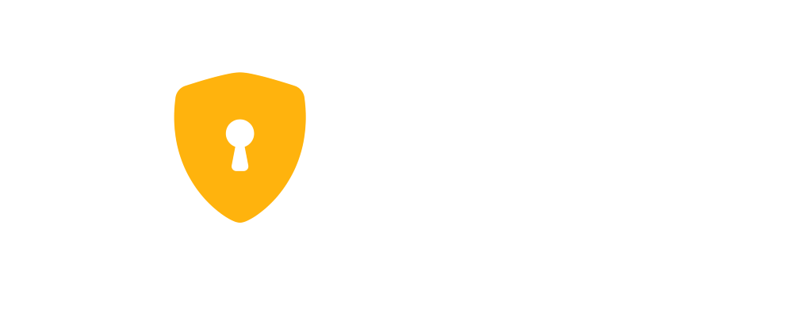

  

<h1 align='center'>Safelock - Credential Manager</h1> 

A website based on Express + React, created with the goal of practicing web knowledge. The project is based on a shared credential manager. Users are free to create vaults to store credentials and share them with whomever they want. In addition (not yet implemented), users can also store credit card information and documents, such as receipts and proof of purchase, with the same freedom to share them. Finally, the application provides a generator for passwords, secret phrases and usernames (Gemini API).

 

# Shortcuts 🎯
  - [Backend Routes](backend/routes)
  - [Backend Models](backend/models)
  - [Frontend Services](frontend/src/services)
  - [Frontend Assets](frontend/src/assets)
  - [Frontend Pages](frontend/src/pages)
  - [Frontend Full Components](frontend/src/components/full)
  - [Frontend Partial Components](frontend/src/components/partials)
 

# Previews and Features 🕹️

## Home Page

  

## Dashboard -> Vaults

  

## Vault Modal

  

## Dashboard -> Generate Username

  

